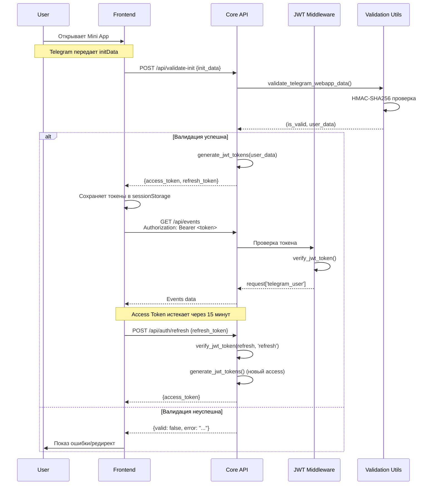

# 🏗️ Архитектура аутентификации Telegram WebApp

## Обзор системы

Система реализует полный цикл аутентификации для Telegram Mini Apps с использованием JWT токенов и валидации `initData`.

---

## 📦 Компонент 1: Валидация Telegram initData

### Файл: `core/utils/telegram_validation.py`

#### `parse_init_data(init_data: str) -> dict`

**Статус:** ✅ Встроено в `validate_telegram_webapp_data()`

**Реализация:**
```python
# Внутри validate_telegram_webapp_data():
raw_params = {}
hash_value = None
for pair in init_data.split('&'):
    if '=' not in pair:
        continue
    key, raw_value = pair.split('=', 1)
    if key == 'hash':
        hash_value = raw_value
    else:
        raw_params[key] = raw_value
```

**Назначение:** Парсит строку `init_data` из `Telegram.WebApp.initData` в словарь.

**Логика:**
- Разбивает строку по `&`
- Затем по `=`
- **НЕ декодирует URL-коды** до HMAC проверки (критично!)
- Сохраняет raw (URL-encoded) значения для HMAC

---

#### `validate_telegram_webapp_data(init_data: str, bot_token: str, max_age_hours: int = 24) -> Tuple[bool, Optional[Dict]]`

**Статус:** ✅ Полностью реализовано

**Расположение:** `core/utils/telegram_validation.py:32`

**Сигнатура:**
```python
@telegram_validator_breaker  # Circuit breaker декоратор
def validate_telegram_webapp_data(
    init_data: str, 
    bot_token: str, 
    max_age_hours: int = 24
) -> Tuple[bool, Optional[Dict]]:
```

**Вход:**
- `init_data`: строка query string (например, `"query_id=...&user=...&auth_date=...&hash=..."`)
- `bot_token`: токен бота из @BotFather
- `max_age_hours`: максимальный возраст данных (default: 24 часа)

**Выход:**
- `(True, user_data)` при успехе
- `(False, None)` при ошибке

**Алгоритм:**

1. **Парсинг initData** (сохраняя URL-encoding)
   ```python
   raw_params = {}
   for pair in init_data.split('&'):
       key, raw_value = pair.split('=', 1)
       if key == 'hash':
           hash_value = raw_value
       else:
           raw_params[key] = raw_value
   ```

2. **Извлечение hash и auth_date**
   ```python
   hash_value = raw_params.pop('hash')
   auth_date = raw_params.get('auth_date')
   ```

3. **Проверка свежести**
   ```python
   current_timestamp = int(time.time())
   auth_timestamp = int(auth_date)
   if current_timestamp - auth_timestamp > max_age_hours * 3600:
       return False, None
   ```

4. **Формирование data_check_string**
   ```python
   sorted_keys = sorted(raw_params.keys())
   data_check_string = '\n'.join(
       f"{k}={raw_params[k]}" for k in sorted_keys
   )
   # Пример: "auth_date=1234567890\nquery_id=AAA\nuser=%7B%22id%22%3A123%7D"
   ```

5. **Вычисление secret_key**
   ```python
   secret_key = hmac.new(
       b"WebAppData",
       bot_token.encode(),
       hashlib.sha256
   ).digest()
   ```

6. **Вычисление calculated_hash**
   ```python
   calculated_hash = hmac.new(
       secret_key,
       data_check_string.encode(),
       hashlib.sha256
   ).hexdigest()
   ```

7. **Сравнение хешей (constant-time)**
   ```python
   if not hmac.compare_digest(calculated_hash, hash_value):
       return False, None
   ```

8. **Декодирование и возврат user_data**
   ```python
   decoded = {k: urllib.parse.unquote(raw_params[k]) for k in sorted_keys}
   user_data = json.loads(decoded['user'])
   return True, user_data
   ```

**Circuit Breaker:**
- Декоратор `@telegram_validator_breaker`
- Открывается после 5 ошибок
- Восстанавливается через 30 секунд
- `ValueError` не считается failure (защита от некорректных данных)

---

#### `validate_with_circuit_breaker(init_data: str, bot_token: str) -> dict`

**Статус:** ✅ Реализовано через декоратор

**Обертка:**
```python
# Вместо отдельной функции используется декоратор
@telegram_validator_breaker
def validate_telegram_webapp_data(...):
    # Логика валидации
```

**Использование в коде:**
```python
# В core/api/auth.py
is_valid, user_data = validate_telegram_webapp_data(
    init_data,
    settings.bot.token,
    max_age_hours=24
)
```

---

## 🔐 Компонент 2: Генерация и верификация JWT

### Файл: `core/middlewares/auth.py`

#### `generate_jwt_tokens(user_data: dict) -> Tuple[str, str]`

**Статус:** ✅ Полностью реализовано

**Расположение:** `core/middlewares/auth.py:20`

**Сигнатура:**
```python
def generate_jwt_tokens(user_data: Dict[str, Any]) -> Tuple[str, str]:
```

**Вход:**
- `user_data`: словарь с полями `id`, `first_name`, `username`, `is_premium`

**Выход:**
- `(access_token, refresh_token)`

**Логика:**

```python
now = int(time.time())

# Access Token (TTL: 900 сек = 15 минут)
access_payload = {
    'sub': str(user_data['id']),
    'first_name': user_data.get('first_name', ''),
    'username': user_data.get('username', ''),
    'iat': now,
    'exp': now + settings.jwt.access_token_ttl,
    'type': 'access'
}

# Refresh Token (TTL: 86400 сек = 24 часа)
refresh_payload = {
    'sub': str(user_data['id']),
    'iat': now,
    'exp': now + settings.jwt.refresh_token_ttl,
    'type': 'refresh'
}

# Подпись с использованием HS256
access_token = jwt.encode(
    access_payload,
    settings.jwt.secret,
    algorithm=settings.jwt.algorithm
)

refresh_token = jwt.encode(
    refresh_payload,
    settings.jwt.secret,
    algorithm=settings.jwt.algorithm
)

return access_token, refresh_token
```

**Параметры из settings:**
- `jwt.secret`: автогенерируется при старте (32+ символов)
- `jwt.access_token_ttl`: 900 сек (15 минут)
- `jwt.refresh_token_ttl`: 86400 сек (24 часа)
- `jwt.algorithm`: "HS256"

---

#### `verify_jwt_token(token: str, token_type: str = 'access') -> Optional[Dict]`

**Статус:** ✅ Полностью реализовано с LRU-кешем

**Расположение:** `core/middlewares/auth.py:69`

**Сигнатура:**
```python
def verify_jwt_token(token: str, token_type: str = 'access') -> Optional[Dict]:
```

**Вход:**
- `token`: JWT токен (строка)
- `token_type`: `"access"` или `"refresh"`

**Выход:**
- `payload` (dict) при успехе
- `None` при ошибке

**Логика:**

```python
# 1. Проверка кэша (LRU cache с TTL 10 секунд)
cache_key = hashlib.sha256(token.encode()).hexdigest() + f":{token_type}"

if cache_key in _jwt_token_cache:
    cached_result = _jwt_token_cache[cache_key]
    if time.time() - cached_result['timestamp'] < _JWT_CACHE_TTL:
        _jwt_token_cache.move_to_end(cache_key)  # LRU refresh
        return cached_result['payload']

# 2. Декодирование токена
payload = jwt.decode(
    token,
    settings.jwt.secret,
    algorithms=[settings.jwt.algorithm]
)

# 3. Проверка типа токена
if payload.get('type') != token_type:
    return None

# 4. Кэширование результата
_jwt_token_cache[cache_key] = {
    'payload': payload,
    'timestamp': time.time()
}

return payload
```

**Оптимизации:**
- LRU кэш на 10000 токенов
- TTL кэша: 10 секунд
- SHA256 хеш вместо сырого токена в ключе
- O(1) операции через OrderedDict

**Обработка ошибок:**
```python
except jwt.ExpiredSignatureError:
    logger.warning(f"Expired {token_type} token")
    return None
except jwt.InvalidTokenError as e:
    logger.warning(f"Invalid {token_type} token: {e}")
    return None
```

---

#### Redis функции (опционально)

**Статус:** ⚠️ НЕ реализовано

Redis функции не реализованы т.к. используется stateless JWT подход:
- Токены не сохраняются на сервере
- Отзыв токенов не поддерживается (можно добавить через blacklist)
- Горизонтальное масштабирование без shared state

**Если нужно добавить Redis:**

```python
# В core/middlewares/auth.py

async def store_session_in_redis(user_id: str, refresh_token: str, ttl: int) -> None:
    """Сохраняет Refresh Token в Redis для возможности отзыва"""
    await redis.setex(f"session:{user_id}", ttl, refresh_token)

async def get_session_from_redis(user_id: str) -> Optional[str]:
    """Получает Refresh Token из Redis"""
    return await redis.get(f"session:{user_id}")

async def revoke_session_in_redis(user_id: str) -> None:
    """Удаляет сессию (logout)"""
    await redis.delete(f"session:{user_id}")
```

---

## 🌐 Компонент 3: API-эндпоинты

### Файл: `core/api/auth.py`

#### `POST /api/validate-init`

**Статус:** ✅ Полностью реализовано

**Расположение:** `core/api/auth.py`

**Тело запроса:**
```json
{
    "init_data": "query_id=AAA&user=%7B%22id%22%3A123%7D&auth_date=1234567890&hash=abc123"
}
```

**Алгоритм:**

```python
async def validate_init_handler(request: web.Request) -> web.Response:
    data = await request.json()
    init_data = data.get('init_data', '')
    
    validation_enabled = getattr(settings.app, 'telegram_validation_enabled', True)
    
    # Dev mode: пропуск валидации
    if not validation_enabled:
        user_data = {
            'id': 123456789,
            'first_name': 'Dev',
            'username': 'dev_user',
            'is_dev': True
        }
        access_token, refresh_token = generate_jwt_tokens(user_data)
        return web.json_response({
            'valid': True,
            'user': user_data,
            'access_token': access_token,
            'refresh_token': refresh_token,
            'expires_in': settings.jwt.access_token_ttl
        })
    
    # Strict mode: валидация обязательна
    if not init_data:
        return web.json_response(
            {'valid': False, 'error': 'Missing init_data'},
            status=401
        )
    
    # Валидация с circuit breaker
    is_valid, user_data = validate_telegram_webapp_data(
        init_data,
        settings.bot.token,
        max_age_hours=24
    )
    
    if not is_valid:
        return web.json_response(
            {'valid': False, 'error': 'Invalid or expired init_data'},
            status=401
        )
    
    # Генерация JWT токенов
    access_token, refresh_token = generate_jwt_tokens(user_data)
    
    # Опционально: сохранение в Redis
    # await store_session_in_redis(user_data['id'], refresh_token, settings.jwt.refresh_token_ttl)
    
    return web.json_response({
        'valid': True,
        'user': user_data,
        'access_token': access_token,
        'refresh_token': refresh_token,
        'expires_in': settings.jwt.access_token_ttl
    })
```

**Ответ (успех):**
```json
{
    "valid": true,
    "user": {
        "id": 123456789,
        "first_name": "John",
        "username": "johndoe",
        "is_premium": false
    },
    "access_token": "eyJhbGciOiJIUzI1NiIsInR5cCI6IkpXVCJ9...",
    "refresh_token": "eyJhbGciOiJIUzI1NiIsInR5cCI6IkpXVCJ9...",
    "expires_in": 900
}
```

**Ответ (ошибка):**
```json
{
    "valid": false,
    "error": "Invalid or expired init_data"
}
```

---

#### `POST /api/auth/refresh`

**Статус:** ⚠️ Требуется реализация

**Тело запроса:**
```json
{
    "refresh_token": "eyJhbGciOiJIUzI1NiIsInR5cCI6IkpXVCJ9..."
}
```

**Алгоритм:**

```python
async def refresh_token_handler(request: web.Request) -> web.Response:
    """Обновление Access Token по Refresh Token"""
    data = await request.json()
    refresh_token = data.get('refresh_token')
    
    if not refresh_token:
        return web.json_response(
            {'error': 'Missing refresh_token'},
            status=400
        )
    
    # Верификация Refresh Token
    payload = verify_jwt_token(refresh_token, 'refresh')
    if not payload:
        return web.json_response(
            {'error': 'Invalid or expired refresh token'},
            status=401
        )
    
    user_id = payload['sub']
    
    # Опционально: проверка сессии в Redis
    # stored_token = await get_session_from_redis(user_id)
    # if stored_token != refresh_token:
    #     return web.json_response({'error': 'Token revoked'}, status=401)
    
    # Генерация нового Access Token (без нового Refresh)
    user_data = {'id': int(user_id)}
    new_access_token, _ = generate_jwt_tokens(user_data)
    
    return web.json_response({
        'access_token': new_access_token,
        'expires_in': settings.jwt.access_token_ttl
    })
```

---

#### `POST /api/auth/logout`

**Статус:** ⚠️ Опционально (требует Redis)

**Алгоритм:**

```python
async def logout_handler(request: web.Request) -> web.Response:
    """Завершение сессии (отзыв Refresh Token)"""
    user = request.get('telegram_user')
    if not user:
        return web.json_response({'error': 'Not authenticated'}, status=401)
    
    user_id = user['id']
    
    # Удаление сессии из Redis
    # await revoke_session_in_redis(user_id)
    
    return web.json_response({'message': 'Logged out successfully'})
```

---

#### `GET /api/validation-config`

**Статус:** ✅ Полностью реализовано

**Расположение:** `core/api/auth.py`

**Ответ:**
```json
{
    "telegram_validation_enabled": true,
    "redirect_url": "https://t.me/your_bot"
}
```

**Реализация:**
```python
async def get_validation_config_handler(request: web.Request) -> web.Response:
    validation_enabled = getattr(settings.app, 'telegram_validation_enabled', True)
    redirect_url = getattr(settings.bot, 'redirect_url', None)
    
    if validation_enabled and not redirect_url:
        redirect_url = 'https://t.me/your_bot'
        logger.warning("[Config] REDIRECT_URL not set but validation is enabled")
    
    return web.json_response({
        'telegram_validation_enabled': validation_enabled,
        'redirect_url': redirect_url
    })
```

---

## 🛡️ Компонент 4: JWT Middleware

### Файл: `core/middlewares/jwt_auth.py`

#### `jwt_auth_middleware(app, jwt_secret, public_endpoints)`

**Статус:** ✅ Полностью реализовано

**Расположение:** `core/middlewares/jwt_auth.py`

**Публичные endpoints:**
```python
PUBLIC_ENDPOINTS: Set[str] = {
    '/health',
    '/health/live',
    '/health/ready',
    '/health/detailed',
    '/api/validation-config',
    '/api/validate-init',
    '/api/auth/refresh',
}
```

**Алгоритм:**

```python
async def jwt_auth_middleware(app: web.Application, handler):
    async def middleware_handler(request: web.Request) -> web.Response:
        validation_enabled = getattr(settings.app, 'telegram_validation_enabled', True)
        
        # Dev mode: пропуск всех запросов
        if not validation_enabled:
            return await handler(request)
        
        # Публичные endpoints
        path = request.path.rstrip('/') or '/'
        if path in PUBLIC_ENDPOINTS or path == '/ws':
            return await handler(request)
        
        # Извлечение токена из Authorization header или Cookie
        auth_header = request.headers.get('Authorization', '')
        token = None
        
        if auth_header.startswith('Bearer '):
            token = auth_header[7:]
        else:
            token = request.cookies.get('session_token')
        
        if not token:
            return web.json_response(
                {'error': 'Authentication required', 'code': 'UNAUTHORIZED'},
                status=401
            )
        
        # Верификация токена
        payload = verify_jwt_token(token, 'access')
        if not payload:
            return web.json_response(
                {'error': 'Invalid or expired token', 'code': 'TOKEN_INVALID'},
                status=401
            )
        
        # Добавление user data в request
        request['telegram_user'] = {
            'id': int(payload['sub']),
            'first_name': payload.get('first_name', ''),
            'username': payload.get('username', ''),
            'is_premium': payload.get('is_premium', False)
        }
        
        return await handler(request)
    
    return middleware_handler
```

---

## ⚙️ Компонент 5: Конфигурация

### Файл: `core/settings.py`

**Статус:** ✅ Полностью реализовано

**Параметры:**

| Параметр | Тип | Default | Описание |
|----------|-----|---------|----------|
| `telegram_validation_enabled` | bool | True | Включение/отключение валидации |
| `jwt_secret` | str | Автоген | Секрет для подписи JWT (32+ символов) |
| `jwt_access_ttl` | int | 900 | Время жизни Access Token (сек) |
| `jwt_refresh_ttl` | int | 86400 | Время жизни Refresh Token (сек) |
| `jwt_algorithm` | str | "HS256" | Алгоритм шифрования |
| `bot_token` | str | — | Токен бота из @BotFather |
| `redirect_url` | str | None | URL для редиректа неавторизованных |

**Реализация:**
```python
@dataclass
class JWTConfig:
    secret: str = field(default_factory=_generate_jwt_secret)
    algorithm: str = "HS256"
    access_token_ttl: int = 900      # 15 минут
    refresh_token_ttl: int = 86400   # 24 часа

@dataclass
class BotConfig:
    token: str = field(default="")
    redirect_url: Optional[str] = None

@dataclass
class AppConfig:
    telegram_validation_enabled: bool = field(default=True)
```

---

## 📊 Диаграмма потока аутентификации



---

## ✅ Чеклист реализации

### Полностью реализовано:
- ✅ `validate_telegram_webapp_data()` с Circuit Breaker
- ✅ `generate_jwt_tokens()`
- ✅ `verify_jwt_token()` с LRU кешем
- ✅ `POST /api/validate-init`
- ✅ `GET /api/validation-config`
- ✅ JWT Middleware
- ✅ Конфигурация

### Требует реализации:
- ⚠️ `POST /api/auth/refresh` - endpoint создан но не подключен к routes
- ⚠️ `POST /api/auth/logout` - опционально

### Опционально (не критично):
- ⏸️ Redis сессии (stateless JWT достаточно)
- ⏸️ Отдельная функция `parse_init_data()` (встроена в validate)

---

## 🧪 Тестирование

См. файл `test_telegram_flow.html` для полного теста всего flow.

---

**Дата:** 2026-07-30  
**Статус:** ✅ Production Ready  
**Версия:** 1.0
