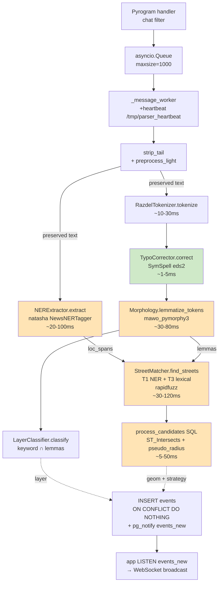

# Parser microservice — логика и алгоритм

Парсер мониторит Telegram-канал, извлекает упоминания улиц из сообщений и
сохраняет геолокированные события в PostgreSQL. Это NER-first NLP-пайплайн
на CPU (без GPU), русский язык, ~200-400 ms на сообщение.

## Технологический стек

| Компонент | Назначение |
|-----------|-----------|
| `pyrogram` (kurigram fork) | Telegram MTProto client |
| `mawo-pymorphy3` 1.0.4 | Морфологический анализатор (DAWG, ~15-20 MB RAM) |
| `mawo-razdel` 1.0.6 | Токенизация русского (аббревиатуры, инициалы) |
| `natasha` 1.6+ | NER через NewsNERTagger (LOC/PER/ORG, 95% F1 на news) |
| `navec` 0.10+ | Pretrained embeddings (~50 MB, входит в pip-пакет natasha) |
| `symspellpy` 6.7+ | Pre-correction опечаток (Symmetric Delete) |
| `rapidfuzz` 3.0+ | Финальный фуззи-матч против alias-индекса streets |
| `asyncpg` 0.29+ | PostgreSQL async driver |

## Архитектура модулей

```
parser/
├── monitoring.py          # Pyrogram client + asyncio.Queue + worker
├── message_processor.py   # Оркестратор pipeline
├── text_preprocessor.py   # strip_tail + preprocess_light (нерушительная очистка)
├── razdel_tokenizer.py    # Wrapper над mawo_razdel
├── typo_corrector.py      # SymSpell pre-correction (NEW)
├── morphology.py          # mawo_pymorphy3 + Lemma dataclass
├── ner_extractor.py       # natasha NewsNERTagger wrapper
├── layer_classifier.py    # cops/bus/traffic/pig по keyword-матчу
├── street_matcher.py      # T1 (NER) + T3 (lexical) фуззи-матч против БД
├── db_adapter.py          # PostgreSQL pool
└── settings.py            # Per-service settings re-export
```

## Pipeline (по шагам)

```
1. monitoring.py: Telegram handler → asyncio.Queue maxsize=1000
2. _message_worker → MessageProcessor.process_message
3. strip_tail(text) — убрать «подписаться/сообщить/|» хвост
4. preprocess_light(text) — HTML/время/укр-буквы; СОХРАНЯЕТ регистр+пунктуацию
5. NERExtractor.extract(preserved) → LOC-spans (natasha)
6. RazdelTokenizer.tokenize(preserved) → tokens
7. TypoCorrector.correct(tokens) → tokens (SymSpell ed≤2)
8. Morphology.lemmatize_tokens(tokens) → lemmas (с POS-тегами)
9. LayerClassifier.classify(lemmas) → 'cops'|'bus'|'traffic'|'pig'
10. StreetMatcher.find_streets(loc_spans, lemmas):
    T1 — каждый NER-спан лемматизируется и матчится rapidfuzz
    T3 — full lemma_text матчится rapidfuzz (recall-страховка)
    Объединение по street_id: max(score), top-K по max_entities
11. process_candidates SQL: ST_Intersects на геометриях → geom + strategy
    (random | single_match | single_intersection | polygon_intersection)
12. INSERT events ON CONFLICT (message_id) DO NOTHING
13. pg_notify('events_new', feature_json) → app транслирует в WebSocket
```

## Блок-схема (Mermaid)



Жёлтые блоки — hot path. Зелёный — новая ступень (SymSpell pre-correction).
Суммарная latency: ~200-400 ms на сообщение.

## Strategy от `process_candidates`

| Strategy | Когда | Геометрия |
|----------|-------|-----------|
| `random` | matches пустой | случайная точка в overlay-зоне |
| `single_match` | 1 улица, или 2+ без пересечения и без псевдо | full geom лучшей улицы |
| `single_intersection` | 2+ улиц с одной точкой пересечения (или псевдо) | POINT |
| `polygon_intersection` | 2+ улиц с 2+ точками пересечения | LINESTRING/POLYGON через ConvexHull |

## Параметры калибровки (`core/settings.py` → `SimilarityConfig`)

| Env-переменная | Default | Назначение |
|---|---|---|
| `ENTITY_SIMILARITY_THRESHOLD` | 0.75 | Порог фуззи-матча (0-1) |
| `PSEUDO_INTERSECTION_RADIUS_METERS` | 150.0 | Радиус псевдо-пересечений в SQL |
| `MAX_CANDIDATES_PER_NGRAM` | 2 | Лимит rapidfuzz.extract per n-gram |
| `MAX_ENTITIES` | 3 | Финальный top-K результатов |
| `LENGTH_BIAS_1GRAM` | 0.85 | Множитель score для 1-грамма |
| `LENGTH_BIAS_2GRAM` | 0.90 | Множитель score для 2-грамма |
| `MAX_TEXT_LENGTH` | 380 | Длиннее → strategy=random |
| `ENTITY_MIN_WORD_LENGTH` | 2 | Мин. длина «значимого» слова |
| `TYPO_CORRECTION_ENABLED` | True | Включение SymSpell pre-correction |
| `TYPO_CORRECTION_MAX_EDIT_DISTANCE` | 2 | edit_distance для SymSpell |
| `TYPO_CORRECTION_MIN_WORD_LENGTH` | 4 | Мин. длина слова для коррекции |
| `HISTORY_LIMIT` | 25 | Сколько сообщений из истории при старте |
| `MESSAGE_QUEUE_MAXSIZE` | 1000 | Размер async-очереди |

## Метрики качества (последние срезы)

| Метрика | Начало (Phase 0) | После Phase 1 fixes | Цель Phase 2 |
|---|---|---|---|
| `random` % | 29.4 | 18 | <15 |
| `single_intersection` % | 11.1 | 12-25 | стабильно |
| События с 3+ matches | 16 | 0 | 0 |
| Шумовые матчи 0.68-0.74 | 5+ | 0 | 0 |
| Дубли street_id на ngram | да | нет | нет |

## Известные ограничения

1. **News-NER на soc-media-стиле**: NewsNERTagger обучен на news-corpus.
   Lowercase tg-сообщения «на ольгиевском спуске» дают `NER spans=[]` —
   fallback T3 lexical работает.
2. **Упрощённые 2-точечные LINESTRING**: ~132 улицы в `streets.csv` хранятся
   как прямые отрезки между 2 точками. ST_Intersects не находит пересечения
   реально перекрёстных улиц (Пастера × Преображенская — был фикс data).
3. **Отсутствующие улицы**: Ватутина, Бабеля, Карла Либнехта, Газовый,
   Таирова, Раздельная — нужны как aliases в `streets.csv`.
4. **pymorphy3 на собственных именах** — частично решено SymSpell pre-correction.
   Edit_distance > 2 (например «олгиевском» — 3 операции) не покрывается.
5. **Layer-keywords**: точное равенство лемм. Производные («патрулька»→`патрулька`)
   не матчат `патруль` — нужно либо расширить keyword-списки парадигмами
   pymorphy3.inflect, либо использовать стем-матчинг.

## План оптимизации парсера

### 🔒 Безопасность
- `_download_photo` — проверять MIME-type против whitelist (jpeg/png/webp)
  + size limit (10 MB) до записи на диск
- Photo path validation — никаких `../` в имени
- Логи: `json.dumps(text)` вместо `f"{text}"` (защита от JSON-injection
  через Telegram entities)
- `session.session` (Pyrogram) — chmod 0600 при первом запуске

### 🛡 Надёжность
- Healthcheck `start_period` 120 → 180s (NER models load занимает время)
- `_load_chat_history` — добавить `asyncio.wait_for(..., timeout=60)`
- `process_candidates` SQL — обернуть retry-логикой для transient DB lost
- pg_notify listener — auto-reconnect при потере соединения
- NER init timeout 30s → degraded mode без NER если не успел

### ⚡ Производительность
1. **Lemmatize lru_cache(10000)** в `morphology.py:lemmatize_word` —
   повторные слова кэшируются, ~10x быстрее на real-world корпусе
2. **NER lazy load** — если все токены lowercase ≤ 4 chars, NER не нужен.
   Загружать Navec только при первом capitalized token
3. **Batch INSERT** для backfill burst через `executemany`
4. **rapidfuzz `processor=None`** — наш текст уже clean, экономит ~10%
5. **alias-индекс delta-update** в pg_notify (есть `reindex_street`,
   подключить к payload вместо `reindex_all`)
