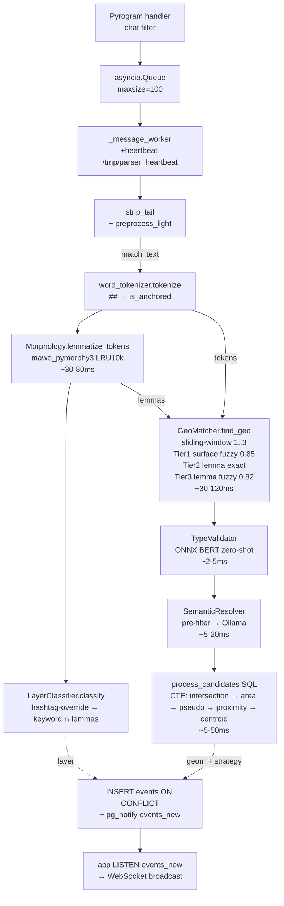

# Parser microservice — логика и алгоритм

> Общая архитектура: [docs/ARCHITECTURE.md](ARCHITECTURE.md)

Парсер мониторит Telegram-канал, извлекает упоминания улиц из сообщений и
сохраняет геолокированные события в PostgreSQL. Sliding-window NLP-пайплайн
на CPU (без GPU и без NER), русский язык, ~80–320 ms на сообщение.

---

## Технологический стек

| Компонент | Назначение |
|-----------|-----------|
| `kurigram` 2.2 | Telegram MTProto client (user session) |
| `mawo-pymorphy3` 1.0.4 | Морфологический анализатор (DAWG, ~15-20 MB RAM) |
| `snowballstemmer` 3.1 | Стемминг (OOV-устойчивый для имен улиц) |
| `rapidfuzz` 3.14 | Surface fuzzy + lemma fuzzy матч |
| `onnxruntime` *(optional)* | rubert-tiny2 ONNX (~15MB), zero-shot type probe; lazy import, graceful fallback if absent |
| `asyncpg` 0.31 | PostgreSQL async driver |

---

## Архитектура модулей

```
parser/
├── monitoring.py          # kurigram client + asyncio.Queue + workers + heartbeat
├── message_processor.py   # Оркестратор pipeline → SQL
├── text_preprocessor.py   # strip_tail + preprocess_light (мягкая очистка)
├── word_tokenizer.py      # regex-разбивка по не-буквенным символам; ## → is_anchored=True
├── morphology.py          # mawo_pymorphy3 + Lemma dataclass + LRU-кэш (10k)
├── layer_classifier.py    # cops/bus/traffic/pig по keyword-матчу (hashtag-override)
├── phonetic_index.py      # Сборщик surface + lemma индексов при старте
├── geo_matcher.py         # Sliding-window линкер: 3 тира (surface/lemma)
├── type_validator.py      # ONNX BERT zero-shot type probe
├── onnx_encoder.py        # rubert-tiny2 ONNX inference (mean-pooling + cosine)
├── semantic_resolver.py   # Pre-filter правила → Ollama (опционально)
├── collector.py           # Сбор метрик
└── db_adapter.py          # PostgreSQL pool
```

---

## Pipeline (по шагам)

```
 1. monitoring.py: Telegram handler → asyncio.Queue(maxsize=100)
 2. _message_worker → MessageProcessor.process_message
 3. _extract_text — plain str из pyrogram, защита от UTF-16 surrogates
 4. strip_tail(text) — убрать «подписаться/сообщить» хвост
 5. preprocess_light(text) — HTML/время/укр-буквы+суффиксы
 6. _sanitize_text — выбросить одиночные суррогаты
 7. strip_emoji → match_text (только для матчинга)
 8. word_tokenizer.tokenize(match_text) → tokens
 9. Morphology.lemmatize_tokens(tokens) → lemmas (pymorphy3, LRU 10k)
10. LayerClassifier.classify(lemmas, tokens) → 'cops'|'bus'|'traffic'|'pig'
    └─ ## -якорные токены проверяются первыми (hashtag-override)
11. [пусто / >380 симв.] → strategy=random, выход
12. GeoMatcher.find_geo(tokens, lemmas):
    _strip_noise (пунктуация)
    _candidates_sliding_window: 1..max_sliding_window(=3) токенов
    для каждого кандидата _link_span:
      Tier 1 [Surface fuzzy] rapidfuzz(surface vs alias-names, порог 0.85)
      Tier 2 [Lemma exact]   O(1) dict lookup по lemma-tuple
      Tier 3 [Lemma fuzzy]   rapidfuzz(lemma_text vs lemma_phrases, порог 0.82)
    dedup по geo_id: max score; is_anchored → +0.05 bonus
    top-K = max_entities(=5)
13. TypeValidator.validate:
    ONNX BERT zero-shot: контекст ±5 токенов → cosine similarity → тип
    Heuristic fallback без модели
14. SemanticResolver.resolve:
    Priority 1: pre-filter правила (предлоги, типы, контекстные маркеры)
    Priority 2: Ollama модель (если enabled)
15. process_candidates SQL (PostGIS): пересечения → geom + strategy
16. INSERT events ON CONFLICT (message_id) + pg_notify('events_new', feature_json)
```

---

## Блок-схема (Mermaid)



---

## Тиры матчинга в `_link_span`

| Тир | Метод | Порог | Описание |
|-----|-------|-------|----------|
| 1 | `fuzz.token_sort_ratio(surface, alias_names)` | 0.85 | Ловит опечатки (чепаевская→чапаевская ≈ 90%) |
| 2 | exact `lemma_tuple` dict lookup | — | O(1), ловит падежи без fuzzy |
| 3 | `fuzz.token_sort_ratio(lemma_text, lemma_phrases)` | 0.82 | Fallback при POS-расхождениях лемматизатора |

---

## TypeValidator (ONNX BERT zero-shot)

| Компонент | Описание |
|-----------|----------|
| Модель | rubert-tiny2 (2-layer BERT, ~15MB ONNX int8) |
| Принцип | Контекст ±5 токенов вокруг кандидата → cosine similarity с типами |
| Fallback | Heuristic markers (без модели) при отсутствии ONNX |
| Порог | confidence ≥ 0.35 → подтверждение типа (кодовая константа, не в SimilarityConfig) |
| Эффект | Совпадение типа → +0.03 bonus; несовпадение → ×0.5 штраф |

---

## Strategy от `process_candidates`

| Strategy | Когда | Геометрия |
|----------|-------|-----------|
| `random` | matches пустой или текст >380 симв. | случайная точка в overlay-зоне |
| `single_match` | 1 улица, или 2+ без пересечения | full geom лучшей улицы |
| `intersection` | 2+ улиц, 1 точка пересечения (или псевдо) | POINT |
| `area` | 2+ улиц, 2+ точек пересечения, все в 1 км | ConvexHull |
| `pseudo_intersection` | 2+ улиц, нет пересечения, но ST_DWithin 150м | середина ShortestLine |
| `proximity` | 2+ улиц, нет пересечения/псевдо, ST_DWithin 500м | середина ShortestLine |
| `centroid` | 2+ кандидатов, ни один выше не подошёл | ST_Centroid |

---

## Параметры калибровки (`core/settings.py` → `SimilarityConfig`)

| Поле | Default | Назначение |
|------|---------|-----------|
| `entity_similarity_threshold` | 0.82 | Порог tier-3 lemma fuzzy (0-1) |
| `phonetic_match_threshold` | 0.85 | Порог tier-1 surface fuzzy (0-1) |
| `surface_typo_threshold` | 0.85 | Порог fuzz.ratio для опечаток (DL 1-2) |
| `max_entities` | 5 | Финальный top-K результатов |
| `max_sliding_window` | 3 | Максимальный размер окна (токенов) |
| `prepositional_boost` | 0.05 | Бонус score при предлоге перед кандидатом |
| `pseudo_intersection_radius_meters` | 150.0 | Радиус псевдо-пересечений в SQL |
| `proximity_radius_meters` | 500.0 | Радиус проксимити |
| `max_text_length` | 380 | Длиннее → strategy=random |
| `lemma_fallback_enabled` | True | Включение tier-3 lemma fuzzy |
| `semantic_enabled` | True | ONNX BERT type validator |
| `semantic_model` | qwen2.5:0.5b | Ollama модель (опционально) |

| Поле (ParserConfig) | Default | Назначение |
|------|---------|-----------|
| `history_limit` | 70 | Сообщений из истории при старте |
| `message_queue_maxsize` | 100 | Размер asyncio.Queue |
| `worker_concurrency` | 5 | Число воркеров очереди |

---

## Метрики качества (~99 событий)

| Стратегия | % | Описание |
|-----------|---|----------|
| single_match | ~58 | Одно geo-существо |
| random | ~28 | Не распознано (нет в газеттире) |
| intersection | ~9 | Пересечение 2+ улиц |
| polygon_intersection | ~5 | ConvexHull кластера |

---

## Известные ограничения

1. **Отсутствующие объекты**: часть улиц не в `geo.csv` → стратегия `random`.
2. **Упрощённые геометрии**: ~132 улицы как прямой отрезок из 2 точек;
   `ST_Intersects` находит пересечение не для всех реально перекрёстных пар.
3. **Sliding-window лимит 3**: улицы из 4+ слов не покрываются одним окном.
4. **Один последовательный воркер**: при росте потока канала throughput упирается
   в одно ядро. Решение: `ProcessPoolExecutor` для CPU-bound операций.
5. **Layer-keywords**: точное равенство лемм. Производные формы расширяются
   через явное перечисление в `DEFAULT_LAYER_KEYWORDS`.
