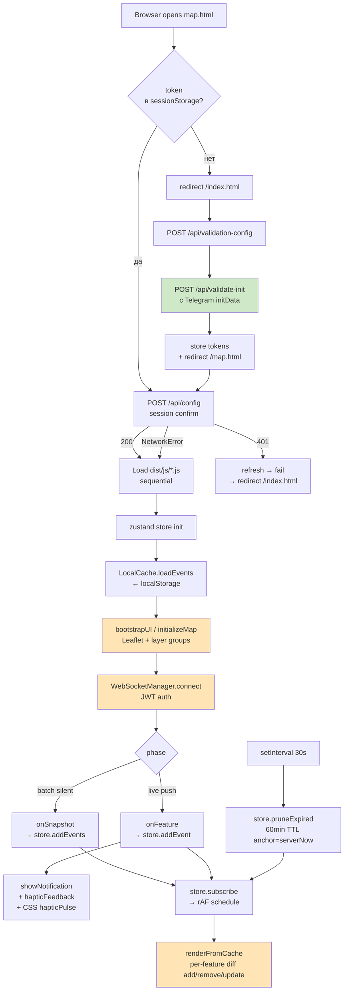

# Web microservice — логика и алгоритм

> Общая архитектура: [docs/ARCHITECTURE.md](ARCHITECTURE.md)

Сервис `web` (контейнер из `Dockerfile.web`) = nginx, который раздаёт
скомпилированный фронтенд и проксирует API/WebSocket на сервис `core`.
Фронтенд — vanilla TypeScript PWA Telegram Mini App: карта на **Leaflet**
(базовый слой — вектор `MapLibre GL` через `maplibre-gl-leaflet`), state — единый
`zustand` store, события из WebSocket агрегируются client-side.

См. также `web/CLAUDE.md` — 8 архитектурных правил-инвариантов, и `nginx.conf`
— reverse-proxy/CSP/кэш-политики.

---

## Технологический стек

| Компонент | Назначение |
|-----------|-----------|
| `leaflet` 1.9.x | Карта + per-feature слои (markers/circles/polylines/polygons) |
| `leaflet.markercluster` 1.5.x | Кластеризация маркеров событий (chunkedLoading) |
| `maplibre-gl` + `maplibre-gl-leaflet` | Вектор-баземап (OpenFreeMap positron) как Leaflet-слой |
| `zustand` 5.x | Reactive store с persistence subscription |
| webpack 5 | Bundle js/* → dist/js/* (production mode) |
| TypeScript 5.3 | **strict: true** (noImplicitAny, strictNullChecks) |
| Telegram WebApp SDK | Через `window.Telegram.WebApp` global (telegram.org/js) |
| nginx:1.27-alpine | Static serving + reverse proxy |

---

## Архитектура модулей

```
web/
├── index.html              # Gate page: /api/validate-init → JWT
├── map.html                # Map page: gate-check → loadScript dist/js/*
├── sw.js                   # Service worker — precaches app shell
├── manifest.webmanifest    # PWA manifest
├── js/
│   ├── common.ts           # window.serverNow, hapticFeedback, showNotification
│   ├── core/
│   │   ├── store.ts        # Zustand store (eventsById, filters, TTL)
│   │   ├── local_cache.ts  # localStorage persistence adapter
│   │   ├── websocket.ts    # /ws connection + reconnect + heartbeat
│   │   ├── event_manager.ts# store.subscribe → rAF scheduler
│   │   ├── map.ts          # popup creators + Leaflet layer creation
│   │   ├── ui.ts           # bootstrapUI, initializeMap, renderFromCache
│   │   ├── data.ts         # Data fetching
│   │   ├── storage.ts      # Storage abstraction
│   │   └── token-manager.ts# JWT refresh loop
│   ├── modules/
│   │   ├── popups.ts       # Legend popup, click handlers
│   │   └── notifications.ts# New-event notification rendering
│   └── telegram/
│       └── integration.ts  # tg.WebApp wrapper, theme, haptic
├── css/
│   └── styles.css
└── dist/                   # webpack output (gitignored)
```

---

## 8 архитектурных правил (web/CLAUDE.md)

1. **PWA microservice** — works online and offline (sw.js precaches shell)
2. **Validation gate** — no components before backend confirms session
3. **Incremental local cache** — store = single source of truth,
   `local_cache.ts` только адаптер localStorage
4. **Full load on connect, then live stream** — batch silent,
   live events trigger notification (boundary = `events_snapshot_end`)
5. **Haptic feedback on every notification** — через `window.hapticFeedback()`
   (с CSS `hapticPulse` fallback)
6. **Event TTL 60 минут** — anchored к `serverNow()` (не device clock)
7. **Optimised for Telegram WebView** — Leaflet per-feature слои +
   инкрементный diff в `renderFromCache` (add/remove/update по id), rAF-driven
8. **Lightweight final image** — multi-stage build, node только в builder

---

## Pipeline загрузки (Mermaid)



---

## TTL и серверное время

```js
// common.js:13
window.serverNow = () => Date.now() + (window.serverClockOffsetMs || 0);

// WebSocket update offset from every message timestamp:
serverClockOffsetMs = serverMs - Date.now();

// store.ts: pruneExpired
const age = serverNow() - feature.properties.time;
if (age > 60*60*1000 || age < -5*60*1000) drop;
```

Это защита от device clock skew / неверного timezone — TTL анкорится на
сервер, не на локальные часы устройства.

---

## TypeScript strict mode

`web/tsconfig.json` включён `strict: true`:

```json
{
  "compilerOptions": {
    "strict": true,
    "noImplicitAny": true,
    "strictNullChecks": true,
    "strictFunctionTypes": true,
    "noFallthroughCasesInSwitch": true,
    "target": "ES2020",
    "module": "ESNext",
    "moduleResolution": "bundler"
  }
}
```

Сборка (`npm run build`) включает `npm run typecheck` в Dockerfile.web —
ошибки типов ломают сборку.

---

## Haptic feedback fallback chain

Telegram WebApp HapticFeedback API:
- v6.1+ → `tg.HapticFeedback.impactOccurred(...)` работает
- v6.0 → API существует, но методы кидают "not supported"
- v5.x и ниже → API отсутствует

Цепочка (`web/js/common.ts:hapticFeedback`):

```
1. Если tg.HapticFeedback существует И version >= 6.1:
   → tg.HapticFeedback.impactOccurred(type)
2. Иначе → telegramIntegration.hapticFeedback()
3. Иначе → navigator.vibrate(N) (HTML5 Vibration API, mobile only)
4. Иначе → silent no-op
```

**Visual fallback** (всегда срабатывает):

```css
@keyframes hapticPulse {
    0% { transform: scale(1) translateX(0); }
    15% { transform: scale(1.02) translateX(-2px); }
    30% { transform: scale(1.02) translateX(2px); }
    /* ... */
}
```

---

## nginx конфигурация

### Rate limiting (nginx edge)

| Зона | Лимит | burst | Назначение |
|------|-------|-------|-----------|
| `api` | 10r/s | 20 | API endpoints |
| `auth` | 1r/s | 5 | /api/validate-init (anti-bruteforce) |

### Security headers

| Header | Значение |
|--------|----------|
| `server_tokens off` | Скрытие версии nginx |
| `X-Frame-Options` | DENY (index.html), SAMEORIGIN (map.html) |
| `X-Content-Type-Options` | nosniff |
| `Referrer-Policy` | strict-origin-when-cross-origin |
| `Content-Security-Policy` | strict CSP для map.html (script-src 'self' https://telegram.org) |

### Кэширование

| Тип файлов | TTL | Cache-Control |
|------------|-----|---------------|
| HTML | no-cache | no-cache, must-revalidate |
| JS (assets/js/) | no-cache | no-cache (bootstrap scripts) |
| JS (dist/) | 7d | public, immutable |
| CSS | 30d | public, immutable |
| Изображения | 365d | public, immutable |
| sw.js | no-cache | no-cache, no-store |

### Real IP

```nginx
set_real_ip_from 10.0.0.0/8;
set_real_ip_from 172.16.0.0/12;
set_real_ip_from 192.168.0.0/16;
real_ip_header X-Forwarded-For;
real_ip_recursive on;
```

---

## Dockerfile.web (multi-stage)

| Stage | Образ | Что делает |
|-------|-------|-----------|
| builder | node:20-alpine | npm ci → typecheck → webpack build |
| runtime | nginx:1.27-alpine | Статика + nginx.conf |

Итого: ~30MB (только nginx + статика, без node/npm/node_modules).

---

## Диагностика «haptic не работает»

### Шаг 1: подтвердить что новый dist в контейнере web

```bash
docker exec web grep -c "navigator.vibrate" /usr/share/nginx/html/dist/js/common.js
# Ожидаем >0. Если 0 — rebuild:
docker compose build web && docker compose up -d web
```

### Шаг 2: инвалидация service worker cache

```js
navigator.serviceWorker.getRegistrations()
    .then(rs => rs.forEach(r => r.unregister()));
// Затем hard reload (Ctrl+Shift+R)
```

### Шаг 3: проверить platform

- **Telegram Mobile (iOS/Android)** → `navigator.vibrate` работает
- **Telegram Desktop** (Qt WebEngine) → нет hardware vibration (by-design)
- **Регулярный браузер** → зависит от browser

CSS `hapticPulse` срабатывает на всех — это visual fallback.

---

## Известные ограничения

1. **Telegram WebApp v6.0**: HapticFeedback API ломаный, fallback через
   navigator.vibrate. На desktop только visual `hapticPulse`
2. **Service worker cache**: после rebuild клиент должен переоткрыть
   WebApp / unregister SW. `__BUILD_ID__` помогает
3. **Leaflet on slow Telegram WebView**: per-feature слои + markercluster
   (chunkedLoading). `renderFromCache` делает инкрементный diff по id
4. **localStorage limits**: ~5 MB per-origin. При 60-min TTL рост контролируется
